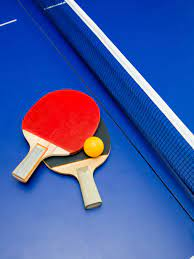

# Shivika Sharma

Hi.
My name is **Shivika Sharma**.

I am a **second year student at IIT Goa**. I study *computer science and engineering*. 

I stay in ***Noida, UP***. I like listening to music and singing.

>## Education

| Year of Graduation     | Degree | Institution |
| :-----------: | :-----------: | :-----------:  |
| 2024      | B. Tech       | Indian Institute of Technology Goa |
| 2020   | 12th standard or equivalent         | Delhi Public School, R. K. Puram |
| 2018   | 10th standard or equivalent         | Delhi Public School, R. K. Puram |

---

> ## 1st-year Courses @ IIT Goa
>> Autumn Semester 
- **BIO101** : Introduction to biology by Dr. Sreenath Balakrishnan 
- **HS101**: Foundation Programme in Humanities and Social Sciences by Dr. Sabiha Hashmi
- **EE100** : Introduction to Profession by Dr. Sashidhar Rao
- **EE101** : Introduction to Electrical and Electronics Engineering by Dr. Sheron Figarado
- **PH101**: Quantum Physics and applications by Dr. Santosh Kumar Das
- **MTH101**: Calculus by Dr. Shiv Prasad 

>> Spring Semester
1. **CH101**: Physical Chemistry by Dr. Siva Subramanium
2. **CH102**: Inorganic and Organic Chemistry by Dr. Mantu Santra
3. **CS101**: Introduction to computing by Dr Clint P George [link](https://clintpgeorge.github.io/cs-101/autumn-2021/)
4. **EE102**: Circuit Analysis by Dr. Sheron Figarado
5. **ME102**: Engineering Graphics and Computer Aided Design by Dr. Anirudh Ambedkar
6. **MTH1021**: Basic Linear Algebra by Dr. Kalpesh Haria
7. **MTH1022**: Ordinary differential equations by Dr. Saumya 
8. **PH102**: Electricity and Magnetism by Dr. Vaibhav Wasnik
9. **CS102**: Software Tools by Dr. Clint P George [link](https://clintpgeorge.github.io/cs-102/spring-2022/git/)

---
> Hobbies 
- Sports
    - Table tennis 
    - Basketball 
  

- Reading
  - As I remember, Adam, it was upon this fashion
bequeathed me by will but poor a thousand crowns,
and, as thou sayest, charged my brother, on his
blessing, to breed me well: and there begins my
sadness. 
    
- Music
    | S. No.| Hobby |
    | :-----------: | :-----------: |
    | 1 | Listening to music |
    | 2 | Singing |
    | 3 | Playing the guitar |

- Watching movies 
   - [Netflix and chill!](https://www.netflix.com)

